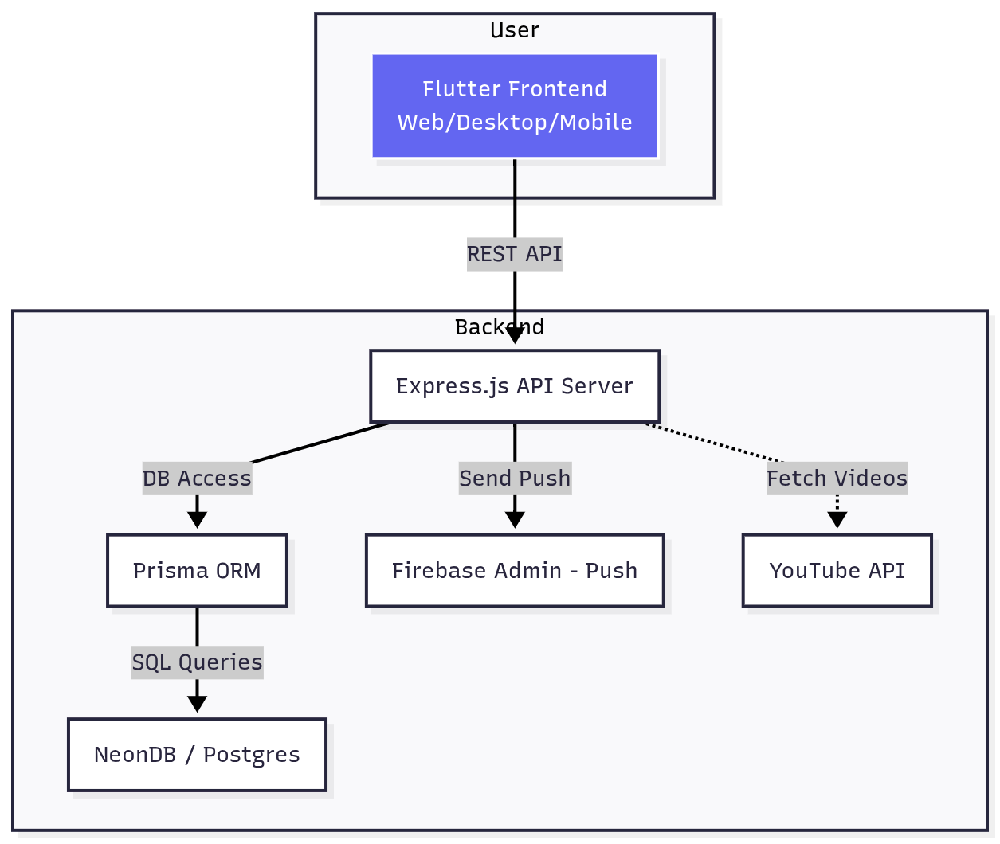

# StreamSync Lite

A premium offline-first streaming platform.

---

## Project Structure

|- frontend/   # Flutter app  
|- backend/    # Node.js/Express/Prisma API

---

## Architecture Diagram

 

---

## Environment Variables

See `/backend/.env.example` for required backend environment variables.

---

## Deployment

### Backend

cd backend
cp .env.example .env # Fill in credentials
docker build -t streamsync-backend .
docker run -p 3000:3000 --env-file .env streamsync-backend

Or, run locally:

npm install
npm run dev

### Frontend

cd frontend
flutter pub get
flutter run -d chrome

---

## Features Shown in Demo

- User registration/login
- Home video feed
- Video playback/seek/favorite
- Offline data access (explain your strategy, e.g., Drift for local caching)
- Notifications: test push 
- Polished, production-grade UI/UX